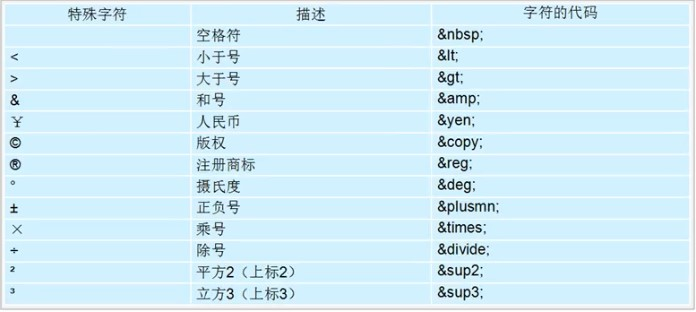

# HTML

## 一、标签

1. `

`:该标签被用来放段落，paragraph的缩写

   **注：段落之间有一定的距离（内外边距）**

2. `
`:分割线 会占一整行

   `
`会按百分比显示， 自带居中

3. ` `：换行标签，对应单词break
4. `<nobr></nobr>` ：不换行
5. `

`：居中显示
6. `<button></button>`：按钮

## 二、转义字符

****

## 三、列表

### 1、无序列表

