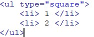

# HTML

## 一、标签

1. `

`:该标签被用来放段落，paragraph的缩写

   **注：段落之间有一定的距离（内外边距）**

2. `
`:分割线 会占一整行

   `
`会按百分比显示， 自带居中

3. ` `：换行标签，对应单词break

4. `<nobr></nobr>` ：不换行

5. `

`：居中显示

6. `<button></button>`：按钮

## 二、转义字符

****

## 三、列表

### 1、无序列表

1、无序列表: Unordered list

` <ul>`  声明一个无序列表

`<li></li> `  列表中每一个选项

` </ul>`

**注：<ul>标签中只能放<li>,但是<li>中可以放任何元素**

2、无序列表属性

  type:如果想去修改无序列表符号，在<ul> 中修改type属性

代码：结果:

默认：disc 实心圆 circle 空心圆  square 实心方块 

无序列表可以嵌套

**如果没有设计符号，则每次嵌套时，符号都会自动使用更低的样式，以square实心方块为最低**