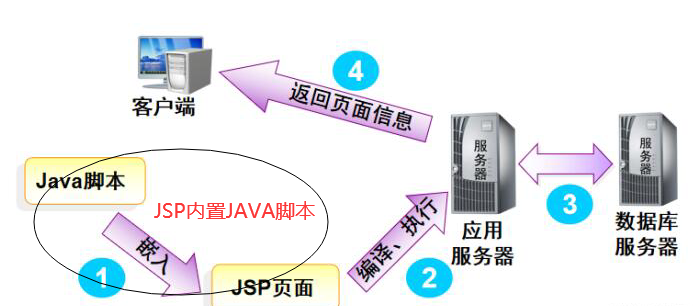
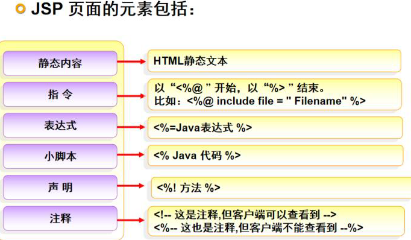
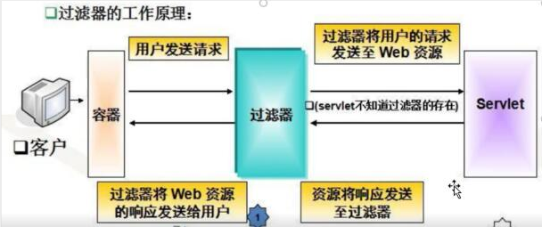

# JSP基础

___Java Server Pages___：java服务器页面，就是在传统的HTML页面，嵌入了java代码，可以实现动态页面效果

__注：页面动态是指JS中使页面能动，动态页面是指页面能传输数据__

JSP执行过程：JSP底层实现就是Java代码

主要过程：jsp页面==>翻译.java文件==>编译成 .class文件==>执行==>返回客户端 HTML页面

index.jsp==>index_jsp.java==>index_jsp.class





## 一、静态内容

就是HTML静态文本

## 二、指令

### 1、**作用**：

用于设置整个JSP页面相关属性，比如：编码方式，脚本语言的类型、文档类型、导入资源文件等

### 2、格式：

<%@ 指令名称 属性名1=属性值1 属性名2=属性值2... %>

### 3、分类:

#### page	

配置JSP页面

1. __contentType__

   1. 设置响应体的mime类型以及字符集

      __注：如果不设置，默认iso-8859-1 北欧语言，不识别中文，需要修改成GBK UTF-8__

      ```java
      <%@page contentType="text/html;charset=UTF-8" %>
      ```

      contenType中可以配置pageEncoding

   2. 设置当前JSP页面的编码（只能是IDE才能生效，如果是低级开发工具，可以通过pageEncoding属性设置当前页面的字符集）

      ```java
      <%@page pageEncoding = "utf-8" %>
      ```

      

2. __language__ 设置支持语言，现在只支持java

   ```java
   <%@page language = "java" %>
   ```

3. __buffer__	缓冲器大小，默认8kb

4. __import__	导包

5. **errorPage**	错误页面	当前页面发生异常后，会自动跳转到指定的错误页面

6. **isErrorPage**	表示当前页面是否是错误页面

7. **isELIgnored**	是否忽略编码方式


#### include	

页面包含的，导入页面的资源文件（jsp）

通常用于引入一些公共的JSP页面，比如说头部信息，尾部信息等

```java
<%include file="指定的页面" %>
```

__注：包含属于静态包含，是将另一个页面中的所有代码复制过来，可能会出现冲突__


#### taglib	

导入资源

用于引入jsp标签库：核心标签库、函数库、格式化库等

```java
<%@taglib uri = "地址" prefix="前缀" %>
```


## 三、注释

```java
<!--注释静态页面-->
<%--脚本注释--%>
```


## 四、java脚本代码

jsp可以嵌入java脚本代码，实现生成动态网页

分为三种：

1. <% 	代码	%>:在编译后的类中的server方法中

2. <%!    代码     %>:在编译后的类中，属于成员变量或者成员方法

3. <%=表达式%>：定义的java代码会输出到页面中

   编译后 = out.print(表达式)

### 1、脚本语言

**语法：**

```jsp
<%
    //java代码
%>

//java脚本代码可以实现拼接：
<%
    for(int i = 0;i < 10;i++){
%>
	<h1>
        测试
	</h1>
<%
    }
%>
//会输出10次测试
```

**注：2同样，只是存在位置不同**

### 2、脚本表达式语言

脚本的表达式语言，可以实现向页面输出内容

可以嵌套在很多地方：html内容中，js内容中

**语法：**

```java
<%=表达式%>
```

结尾不需要；


## 五、http协议

HTTP协议是超文本传输协议，是一种用于万维网（www）服务器传输超文本内容到本地浏览器的传输协议，相当于服务器和浏览器进行数据交互（数据传递）。基于请求和响应

### 1、特点

1. **无连接**：

   无连接的含义是限制每次连接只处理一个请求。

   服务器处理完客户的请求，并收到客户的应答后，即断开连接。采用这种方式可以节省传输时间。

2. **无状态**：

   无状态是指协议对于事务处理没有记忆能力，服务器不知道客户端是什么状态。

   即我们给服务器发送 HTTP 请求之后，服务器根据请求，会给我们发送数据过来，但是，发送完，不会记录任何信息。

3. __灵活__：

   HTTP允许传输任意类型的数据对象。

   正在传输的类型由Content-Type（Content-Type是HTTP包中用来表示内容类型的标识）加以标记。

4. __支持客户/服务器模式__

5. __简单快速__：

   客户向服务器请求服务时，只需传送请求方法和路径。

   请求方法常用的有GET、HEAD、POST。每种方法规定了客户与服务器联系的类型不同。

### 2、HTTP请求方式

常见的：

1. **get请求**：用于获取服务器资源

   1. 图片 css js等通过src请求地址
   2. 通过地址栏输入的地址访问
   3. 超链接
   4. location.href=' ' 

2. __post请求__：用于向服务器提交数据

   1. 表单提交	

      `<form action = " " method ="post">`

3. __put请求__：用于修改服务器数据

4. __delete请求__：用于删除服务器数据


### 3、HTTP状态码 Status Code

http状态码：用于表示请求状态

1. 200	正常，请求成功

2. 500    服务器程序异常（代码写错了）

3. 404    找不到对应资源（路径写错了，页面在web-INF包中）

4. 400    服务器接收数据异常

5. 403    请求被拒绝

6. 302    重定向

   

## 六、九大内置对象

内置对象：只要导入了jsp相关jar包，就可以直接使用的对象

1. **request**：请求，___类型 HttpServletRequest___

   用于封装一次请求信息，一个HTTP请求就是一个request对象

2. **response**：响应，___类型 HttpServletResponse___

   用于封装一次响应信息，一个HTTP请求也会对应一个reponse对象

3. **out**：本质上是一个流（输出字符流），___类型 JSPWriter___

   用于向页面输入内容

4. **session**：___类型 HttpSession___

   用于表示当前会话，相当于服务器和浏览器通一次电话（包含多次请求）

   一般来说，一个客户端就是一个session

5. **application**：___类型 ServletContext___

   表示应用级，一个项目一般只有一个application对象

6. **config**：jsp页面配置信息  ___类型 ServletConfig___

7. **pageContext**：当前页面上下文内容（页面中的所有对象，可以获取其他八个对象）

8. **page**：表示当前页面 类似this  ___类型 Object___

9. **exception**：JSP页面中的异常对象  ___类型 Throwable___

   注：在isErrorPage=ture 的page中才会有


## 七、request对象

request请求对象：每次发送HTTP请求，都会把所有请求信息封装到请求对象中

包括：请求地址、请求方式、请求数据、请求编码方式等头部信息

__注：submit提交给action地址的是表单元素的value值__

### 1、常用方法

1. **String getParameter(String name)**	

   根据表单提交中的name值，来获取提交的数据

2. **String[] getParameterValuse(String name)**

   通过name获取多个提交的数据

3. **setCharacterEncoding(String charset)**

   用于设定指定请求的编码方式

   **注：需要在getParamenter之前使用，否则无效**

4. 


## 八、requset传值方式

有get形式和post形式

### 1、get传值

请求地址？key=value&key2=value2...

通过request.getParameter("key")获取value

可以通过get方式，传递一些id主键外键之类的字段，不会传递重要信息

### 2、get请求和post请求的区别	面试题

1. 使用场景不同

   * get请求常用于获取服务器资源

   * post请求常用于提交数据，类似于form表单提交数据
2. 数据传输方式不同

   * get 请求会在地址栏显示
     * 数据不安全
     * 地址栏长度是有限制的，最大2048字节（2k）
   * post 数据提交是隐式提交
     * 数据随着请求头部信息提交
     * 不会在地址栏显示，没有长度限制
3. 上传文件只能使用post请求


## 九、转发和重定向

重定向

``` java
response.sendRedirect("地址");
```


转发

``` java
request.getRequestDispatcher("地址");
//转发可以传递数据	通过forward方法
request.getRequestDispatcher("地址").forward(request,response);
```

request.getRequestDispatcher()方法只是获取到了RequestDispatcher()对象，并未执行真正的转发，执行转发动作还需调用RequestDispatcher()的forward()。

### 区别 面试题

1. **跳转范围**

   * 转发只能服务器内实现跳转

   * 重定向可以在内部使用，也可以跳转到服务器外部。

   注：转发的路径只能写相对路径

   ​		转发会默认添加项目路径，即写绝对路径会有两个项目路径，导致404

2. **参数共享性**

   * 转发只发送一次请求，所以通过请求传递的参数是可以共享的

   * 重定向属于两次请求，先发送302表示临时重定向，然后再发送get请求访问目标地址，请求跨越了，所以请求的参数是不可以共享的

3. **地址**

   * 转发地址不会发生改变
   * 重定向由于是两次请求，会重新定位一个新的地址，所以地址栏会发送改变

4. **性能方面**

   * 转发请求次数少，占用资源少
   * 重定向需要请求两次，占用资源较多

   转发性能优于重定向，后期大部分使用转发


##  十、session对象

session类型HttpSession，用于表示会话

会话：浏览器和服务器之间的一次通话，会包含很多次请求和响应

使用范围：一个会话，大于request和response

创建会话：浏览器第一次向服务器发送请求时，服务器才会创建会话对象

会话结束：浏览器关闭，会话结束（并不是会话删除）

### 1、常用方法:

1. setAttrbute(String key, Object value)：在seesion范围之内 可以存储任何类型的数据

2. Object  getAttribute(String key )：在session之内获取数据，通过key获取Object value值

3. getId()：用于获取session的唯一标识：sesssionID

4. setMaxInactiveInterval()：设置session有效时间   以 秒 为单位队的

   如果不设置时间，Tomact默认30分钟

5. getMaxInactiveInterval()：获取session有效时间

6. invalidate()：立即销毁session

### 2、Session的应用场景：

1. 验证登录，如果没有登录，是不能访问后台页面
2. 通过Session保存一些用户信息，以及经常会使用的信息

### 3、session技术：

​		将数据存储到服务器的管理会话的技术，服务器会对每一个客户端都会去创建一个会话，保存在服务器中，用于保存用户信息，每一个会话都会有一个sessionID，浏览器第一次发送请求时，服务器会创建session，同时把刚创建好的sessionID返回个浏览器，浏览器通过缓存（Cookie）保存sessionID。浏览器的非第一次请求都会携带含有sessionID的缓存信息，用于获取对应的session。如果浏览器关闭了，表示会话关闭，只是浏览器保存的sessionID没有了，所以在发送请求已经找不到之前的session，session只有超时或者调用invalidate()方法强制删除


## 十一、Cookie对象

###  1、创建Cookie

`Cookie coo = new Cookie(String key,String value);`

**注：Cookie没有提供无参构造，一定需要参数**

### 2、将Cookie存入响应信息

`response.addCookie();`

### 3、通过请求获取所有Cookie信息

`Cookies[] coos =  Request.getCookies();`


## 十二、Session和Cookie区别 面试题

### 存储位置不同

* Cookie存储在客户端
* Session存储在服务器

### 存储的数据不同

* Cookie只能存储字符串数据
* Session可以存储任意数据

### 存储数据限制

* Cookie 存储数据大小有限制，但保存时间较长
* Session 没有限制大小，但保存时间较短

### 安全性不同

* Session保存在服务器中
* Cookie保存在浏览器中，可以被访问到

**总结：Session比Cookie更安全**


## 十三、Appliaction

appliaction类似于系统的全局变量，一个项目中，一般情况下只会有一个appliaction

所以说可以向application存储数据，数据会在所有用户之间共享，所以说范围会超过session


setAttribute(String key,Objcet value);

getAttribute(String key);

removeAttribute(String ky);

page request session Appliaction四个对象都拥有上述方法


## 十四、四大域对象

1. page:表示当前页面，类似于this，存储的数据只在当前页面有效

2. request:在一次请求之中，请求结束，数据失效

3. session:一次会话中，会话结束，数据失效

4. application:一次项目中，项目关闭（关服务器），数据失效

这四种对象被成为 四大作用域

**注：page没有方法，使用pageContext对象调用**

pageContext	可以描述所有的对象，包括四大作用域，可以同时描述四大作用域范围

``` java
pageContext.setAttribute(String key,Object value,int scope);
scope:
page	1
request	2
session	3
application	4
page可以不写，默认page
可以通过pageContext类中的常量表示
PageContext.REQUEST_SCOPE

pageContext.setAttribute("abc",100);//page
pageContext.setAttribute("abc",100,PageContext.REQUEST_SCOPE);//2
pageContext.setAttribute("abc",100,PageContext.SESSION_SCOPE);//3
pageContext.setAttribute("abc",100,PageContext.APPLICATION_SCOPE);//4

//获取
pageContext.getAttribute("abc",PageContext.REQUEST_SCOPE);
```

**注：获取值时，如果同名参数，按优先级取值，即page优先，application最后**


pagetContext	include方法 类似include指令，但是会有区别

include指令：等于复制粘贴，将代码全部复制过来再进行编译

include方法：类似于方法调用，先编译代码，然后再将其他页面信息在本页面展示出来

比如：

用include指令，1页面中page存储信息可以被2页面调用

而方法不行	


### 4、隐藏对象

1. pageScope：在page作用域内的数据

   requestScope：在request作用域

   sessionScope	applicationScope

2. param：获取request请求参数对象，等价于request.getParameter

   paramValues：获取request请求参数对象（多个），等价于request.getParameterValues

3. header：获取HTTP请求头的信息

4. cookie：获取cookie缓存中的信息


## 十五、getAttribute和getParamenter区别


```jsp
    request.getAttribute("");
    request.getParameter("");
```

二者区别

### 1、获取的数据不同

​    getParameter 获取请求的参数 获取的是提交的数据（form表单或者？key=value的get形式）
​    getAttribute 获取请求作用域的值  获取的是setAttribute中的值

 ###   2、返回值不同

​    getParameter String
​    getAttribute Object

  ###   3、传递数值也不同

​    getParameter form表单或者get只能传递字符串
​    getAttribute 可以获取任何形式


# JSP高级

## 一、Servlet

servlet用于实现控制层，是Java服务端用于处理用户请求和响应的java程序，实现和control.jsp几乎一致

### 1、Servlet实现方式

1. 实现一个Servlet接口

   service方法 可以接受任何请求方式

2. 继承一个HttpServlet类   

   常用，适合处理HTTP请求 doXxx()方法可以针对不同请求处理

### 2、配置Servlet

1. 通过配置文件：XML	可扩展标记语言

   ```xml
   <!--Tomcat服务器负责读取web.xml-->
       <!--
           name自定义，但是必须和mapping中相同
           表示一组标签
           class 表示那个类,使用类的全类名
       -->
       <servlet>
           <servlet-name>a</servlet-name>
           <servlet-class>controller.FirstServlet</servlet-class>
           
           <!--
           配置初始化参数，会把参数的值封装到ServletConfig中
   		在Servlet中直接调用getInitParameter("name")
   		等同于this.getServletCofig().getInitParameter("name")
       	-->
           <init-param>
           	<param-name>req</param-name>
               <param-value>utf-8</param-value>
           </init-param>
            <init-param>
           	<param-name>resp</param-name>
               <param-value>text/html;charset=utf-8</param-value>
           </init-param>
           
           <!--
           因为init是默认用户第一次发送请求时执行，就会有以下问题
           1.第一次请求需要执行初始化，会有延迟
           2.init中代码报错，只有用户第一次访问才会发现
   
           为了解决这些问题，就需要服务器在启动时候就加载好Servlet执行init初始化
           添加load-on-startup    默认为负数，表示第一次访问时执行
           可以配置为正数（1-10）设置为服务器启动时加载
           值越大 启动优先级越小 按1-10顺序执行
           -->
           <load-on-startup>1</load-on-startup>       
           
           <!--
           注：标签执行是有顺序的，name,values,init-param,load
           -->
       </servlet>
   
       <servlet-mapping>
           <servlet-name>a</servlet-name>
           <!--
           指定好Servlet请求地址
           注：前面得  /
           -->
           <url-pattern>/aaa</url-pattern>
       </servlet-mapping>
   ```

2. 通过注解

   1. 简化版 无load-on-startup

      ``` java
      @WebServlet("/abc")
      //等价于 servlet 和Servlet mapping标签
      //"/abc" 等价于 url-pattern
      ```

      

   2. 完全体

      ```java
      @WebServlet(
              displayName = "user",//servlet名称
              urlPatterns = "/aaa",//请求地址
              loadOnStartup = 1   //设置服务器启动时是否执行加载
      )
      ```


### 3、Servlet生命周期

1. **实例化**

   1. 默认情况下，第一次访问Servlet
   2. 如果配置了load-on-startup 则服务器会在启动时候执行实例化

   注：每一个Servlet都是单例，只会实例化一次

2. **初始化**

   在实例化的同时，初始化

3. **处理请求**

   每发送一次请求，都会执行一次service方法，service方法会根据请求的不同分别调用doXxx();

4. **销毁**

   容器关闭（Tomcat服务器关闭），会执行**destory**方法销毁


## 二、分页

分页是将所有数据分段展示给用户的技术，用户每次看到的数据不是全部数据，而是数据的一部分。用户只要通过指定的页码数就可以切换数据。项目中凡是存在列表，都必须写分页

### 1、分页的步骤

1. 分页的sql语句

   oracle rownum分页

   mysql limit关键字

2. 数据初始化 

   准备好分页需要的数据，通过工具类


## 三、文件的上传下载

上传文件 上传头像 通过Java将本地文件上传服务器

### 1、上传文件的前提

1. 请求方式必须是post

2. 传值方式需要改变

   form表单中的enctype属性默认

   ```js
   enctype="application/x-www-form-urlencoded"
   ```

   表示数据以字符串形式传值提交到服务器

   

   需要修改成：

   ```js
   enctype="multipart/form-data"
   ```

   表示数据通过附件形式提交到服务器

   

3. 在Servlet层中要实现上传下载

   实现上传下载需要加上注解：**@MultipartConfig**

   **注：对@MultipartConfig标注的说明。**

   @MultipartConfig标注有以下的属性可用。

   1. fileSizeThreshold:整数值设置，默认值为0，若上传文件的大小超过了这个值，就会先写入缓存文件。

   2. location:字符串设置，默认值为空字符串。如果设置这个属性，缓存文件就是写到指定目录

   3. maxFileSize:限制文件上传大小。默认值为-1L，表示不限制大小。

   4. maxRequestSize:限制multipart/form-data请求格式，默认值为-1L，表示不限制个数。

   

### 2、实现上传图片的同时显示图片

```jsp
<form action="/up?pre=upload" method="post" enctype="multipart/form-data">
    <input type="file" name="myFile" onchange="showImg(this)">
    
    <input type="submit">
</form>

<script type="text/javascript">
    function showImg(thisObject) {
        //获取图片对象
        var imgFile = thisObject.files[0];
        //通过图片对象获取地址
        var url = window.URL.createObjectURL(imgFile);
        //把地址给Src赋值
        //setAttribute修改属性值
        document.getElementById("img").setAttribute("src", url);
    }
</script>
```


### 3、Servlet中实现上传功能

1. 获取文件对象

   1. 通过请求获取对应文件对象

   ```java
   Part imgFile = req.getPart("myFile");
   //类似于req.getParameter
   //Part是一个连接
   ```

   2. 获取文件的文件名

   ```java
   //获取文件名
   String fileName = imgFile.getSubmittedFileName();
   //该方法只能TOMCAT1.8以上才能使用
   
   //获取文件后缀
   String suffix = fileName.substring(fileName.lastIndexOf("."));
   
   //创建新的文件名
   String newFileName = UUID.randomUUID().toString() + suffix;
   ```

2. 保存到项目路径

   1. 获取文件保存地址的真实路径

   ```java
   //1.获取服务器的真实路径
   String path = req.getServletContext().getRealPath("/upload");
   //自动在后面+/upload
   ```

   2. 获取文件写入的文件地址

   ```java
   //2.获取IO流需要写入的路径
   String filePath = path + File.separator + newFileName;
   //File.separator为自动生成 斜杠/ 因为不同环境斜杠可能不同
   ```

   **注：因为不同系统的斜杠是不同的，所以说需要自动获取，通过File文件的separator属性**

   3. 通过IO流写入

   ```java
   //三.通过IO流写入
   //Part提供了一个写入方法write 调用就完事了
   //Part本身就是一个连接
   File f = new File(filePath);
   if (!f.exists()) {
       f.mkdirs();
   }
   imgFile.write(filePath);
   ```

   **注：Part详解：https://www.cnblogs.com/sunyongxing/articles/2622891.html**

### 4、Servlet中实现下载功能

1. 通过请求传递的文件名获取文件绝对路径

```java
//获取文件名
String fileName = req.getParameter("fileName");
//获取绝对路径
String filePath = req.getServletContext().getRealPath("/upload") + File.separator + fileName;
```

2. 设置响应头部信息

```java
// resp.setHeader(内容意向"content-disposition","attachment;filename=" + fileName);
//                                       指定附件形式下载，并且指定下载后的名称
resp.setHeader("content-disposition", "attachment;filename=" + fileName);
```

3. 通过IO流传输

```java
ServletOutputStream sos = resp.getOutputStream();
FileInputStream fis = new FileInputStream(filePath);
byte[] bytes = new byte[1024];
Integer length;
while ((length = fis.read(bytes)) != -1) {
    sos.write(bytes, 0, length);
}
fis.close();
sos.close();
```


## 四、过滤器 Filter 

过滤器能够对所有进入Web资源的请求进行拦截，在请求前和响应后做一些特殊处理，如：

1. 实现用户登录拦截
2. 敏感词过滤
3. 权限控制
4. 字符集编码设置
5. 公共功能：比如说关闭资源

**注：过滤器相当于一个特殊的Servlet（配置和代码都类似Servlet）**



### 1、实现过滤器

1. 实现一个 filter 接口

   **注：javax.servlet包下的**

2. 实现三个方法：

   1. init() 初始化
   2. doFilter() 拦截请求的方法
   3. destory() 销毁

3. 配置过滤器

   1. 配置文件

      ```xml
      <!--
          同Servlet
      -->
       <filter>
           <filter-name>encoding</filter-name>
           <filter-class>com.sc.filter.EncodingFilter</filter-class>
      
           <!--
               初始化参数
               会封装到filterConfig对象中
           -->
           <init-param>
               <param-name>req</param-name>
               <param-value>utf-8</param-value>
           </init-param>
      
           <init-param>
               <param-name>resp</param-name>
               <param-value>text/html;charset=utf-8</param-value>
           </init-param>
       </filter>
      
       <!--
           url：过滤地址
           如果是所有都需要过滤 /*
           /*表示所有请求都会经过过滤器
           请求：服务器中的所有资源 Servlet jsp css 图片等
      
           /doXXX 表示对doXXX请求都会走过滤器
       -->
       <filter-mapping>
           <filter-name>encoding</filter-name>
           <url-pattern>/*</url-pattern>
       </filter-mapping>
      
      
       <!--
          session过滤器配置
       -->
       <filter>
           <filter-name>session</filter-name>
           <filter-class>com.sc.filter.sessionFilter</filter-class>
       </filter>
       <filter-mapping>
           
           <filter-name>session</filter-name>
           <url-pattern>/newspages/*</url-pattern>
           <!--
               表示newspages包下的所有文件都过滤
           -->
       </filter-mapping>
      
       <!--
           过滤器可以配置多个 如果有多个要按照一定顺序过滤
           过滤顺序是按照配置文件中 filter-mapping顺序来的
      
           通过注解不好调整顺序
       -->
      ```

   2. 注解

      ```java
      @WebFilter
      ```

### 2、拦截处理请求doFilter

```java
 @Override
    public void doFilter(ServletRequest servletRequest, ServletResponse servletResponse, FilterChain filterChain) throws IOException, ServletException {
        System.out.println("过滤器处理请求");

        //1.实现过滤规则
        servletRequest.setCharacterEncoding(reqValue);
        servletResponse.setContentType(respValue);

        //2.满足要求放行
        //通过filterChain中的 doFilter放行
        //一定要放行，要不然所有请求就会被拦截 停止在当前页面
        filterChain.doFilter(servletRequest, servletResponse);

        //放行后 如果有其他过滤器再经过其他过滤器
        //全部过滤后才会访问web资源
        //3.不满足 可以跳转
        //转换为子类调用方法
        HttpServletResponse resp = (HttpServletResponse) servletResponse;
        resp.sendRedirect("index.jsp");
    }
```