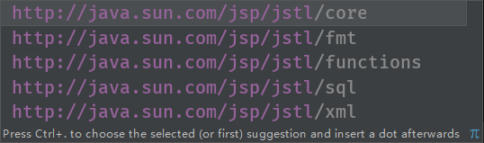

# JSP

___Java Server Pages___：java服务器页面，就是在传统的HTML页面，嵌入了java代码，可以实现动态页面效果

__注：页面动态是指JS中使页面能动，动态页面是指页面能传输数据__

JSP执行过程：JSP底层实现就是Java代码

主要过程：jsp页面==>翻译.java文件==>编译成 .class文件==>执行==>返回客户端 HTML页面

index.jsp==>index_jsp.java==>index_jsp.class


## 一、静态内容

就是HTML静态文本

## 二、指令

### 1、**作用**：

用于设置整个JSP页面相关属性，比如：编码方式，脚本语言的类型、文档类型、导入资源文件等

### 2、格式：

<%@ 指令名称 属性名1=属性值1 属性名2=属性值2... %>

### 3、分类:

### page	

配置JSP页面

1. __contentType__

   1. 设置响应体的mime类型以及字符集

      __注：如果不设置，默认iso-8859-1 北欧语言，不识别中文，需要修改成GBK UTF-8__

      ```java
      <%@page contentType="text/html;charset=UTF-8" %>
      ```

      contenType中可以配置pageEncoding

   2. 设置当前JSP页面的编码（只能是IDE才能生效，如果是低级开发工具，可以通过pageEncoding属性设置当前页面的字符集）

      ```java
      <%@page pageEncoding = "utf-8" %>
      ```

      

2. __language__ 设置支持语言，现在只支持java

   ```java
   <%@page language = "java" %>
   ```

3. __buffer__	缓冲器大小，默认8kb

4. __import__	导包

5. **errorPage**	错误页面	当前页面发生异常后，会自动跳转到指定的错误页面

6. **isErrorPage**	表示当前页面是否是错误页面

7. **isELIgnored**	是否忽略编码方式


### include	

页面包含的，导入页面的资源文件（jsp）

通常用于引入一些公共的JSP页面，比如说头部信息，尾部信息等

```java
<%include file="指定的页面" %>
```

__注：包含属于静态包含，是将另一个页面中的所有代码复制过来，可能会出现冲突__


### taglib	

导入资源

用于引入jsp标签库：核心标签库、函数库、格式化库等

```java
<%@taglib uri = "地址" prefix="前缀" %>
```


## 三、注释

```java
<!--注释静态页面-->
<%--脚本注释--%>
```

## 四、java脚本代码

jsp可以嵌入java脚本代码，实现生成动态网页

分为三种：

1. <% 	代码	%>:在编译后的类中的server方法中

2. <%!    代码     %>:在编译后的类中，属于成员变量或者成员方法

3. <%=表达式%>：定义的java代码会输出到页面中

   编译后 = out.print(表达式)

### 1、脚本语言

**语法：**

```jsp
<%
    //java代码
%>

//java脚本代码可以实现拼接：
<%
    for(int i = 0;i < 10;i++){
%>
	<h1>
        测试
	</h1>
<%
    }
%>
//会输出10次测试
```

**注：2同样，只是存在位置不同**

### 2、脚本表达式语言

脚本的表达式语言，可以实现向页面输出内容

可以嵌套在很多地方：html内容中，js内容中

**语法：**

```java
<%=表达式%>
```

结尾不需要；

## 五、http协议

HTTP协议是超文本传输协议，是一种用于万维网（www）服务器传输超文本内容到本地浏览器的传输协议，相当于服务器和浏览器进行数据交互（数据传递）。基于请求和响应

### 1、特点

1. **无连接**：

   无连接的含义是限制每次连接只处理一个请求。

   服务器处理完客户的请求，并收到客户的应答后，即断开连接。采用这种方式可以节省传输时间。

2. **无状态**：

   无状态是指协议对于事务处理没有记忆能力，服务器不知道客户端是什么状态。

   即我们给服务器发送 HTTP 请求之后，服务器根据请求，会给我们发送数据过来，但是，发送完，不会记录任何信息。

3. __灵活__：

   HTTP允许传输任意类型的数据对象。

   正在传输的类型由Content-Type（Content-Type是HTTP包中用来表示内容类型的标识）加以标记。

4. __支持客户/服务器模式__

5. __简单快速__：

   客户向服务器请求服务时，只需传送请求方法和路径。

   请求方法常用的有GET、HEAD、POST。每种方法规定了客户与服务器联系的类型不同。

### 2、HTTP请求方式

常见的：

1. **get请求**：用于获取服务器资源

   1. 图片 css js等通过src请求地址
   2. 通过地址栏输入的地址访问
   3. 超链接
   4. location.href=' ' 

2. __post请求__：用于向服务器提交数据

   1. 表单提交	

      `<form action = " " method ="post">`

3. __put请求__：用于修改服务器数据

4. __delete请求__：用于删除服务器数据


### 3、HTTP状态码 Status Code

http状态码：用于表示请求状态

1. 200	正常，请求成功

2. 500    服务器程序异常（代码写错了）

3. 404    找不到对应资源（路径写错了，页面在web-INF包中）

4. 400    服务器接收数据异常

5. 403    请求被拒绝

6. 302    重定向

   


## 六、九大内置对象

内置对象：只要导入了jsp相关jar包，就可以直接使用的对象

1. **request**：请求，___类型 HttpServletRequest___

   用于代表封装一次请求，一个HTTP请求就是一个request对象

2. **response**：响应，___类型 HttpServletResponse___

   用于封装响应信息，一个HTTP请求也会对应一个reponse对象

3. **out**：本质上是一个流（输出字符流），___类型 JSPWriter___

   用于向页面输入内容

4. **session**：___类型 HttpSession___

   用于表示当前会话，相当于服务器和浏览器通一次电话（包含多次请求）

   一般来说，一个客户端就是一个session

5. **application**：___类型 ServletContext___

   表示应用级，一个项目一般只有一个application对象

6. **config**：jsp页面配置信息  ___类型 ServletConfig___

7. **pageContext**：当前页面上下文内容（页面中的所有对象，可以获取其他八个对象）

8. **page**：表示当前页面 类似this  ___类型 Object___

9. **exception**：JSP页面中的异常对象  ___类型 Throwable___

   注：在isErrorPage=ture 的page中才会有

## 七、request对象

request请求对象：每次发送HTTP请求，都会把所有请求信息封装到请求对象中

包括：请求地址、请求方式、请求数据、请求编码方式等头部信息

__注：submit提交给action地址的是表单元素的value值__

### 1、常用方法

1. **String getParameter(String name)**	

   根据表单提交中的name值，来获取提交的数据

2. **String[] getParameterValuse(String name)**

   通过name获取多个提交的数据

3. **setCharacterEncoding(String charset)**

   用于设定指定请求的编码方式

   **注：需要在getParamenter之前使用，否则无效**

4. 

## 八、get请求传值方式

### 1、get传值

请求地址？key=value&key2=value2...

通过request.getParameter("key")获取value

可以通过get方式，传递一些id主键外键之类的字段，不会传递重要信息

### 2、get请求和post请求的区别	面试题

1. 使用场景不同

   * get请求常用于获取服务器资源

   * post请求常用于提交数据，类似于form表单提交数据
2. 数据传输方式不同

   * get 请求会在地址栏显示
     * 数据不安全
     * 地址栏长度是有限制的，最大2048字节（2k）
   * post 数据提交是隐式提交
     * 数据随着请求头部信息提交
     * 不会在地址栏显示，没有长度限制
3. 上传文件只能使用post请求

## 九、转发和重定向

重定向

``` java
response.sendRedirect("地址");
```


转发

``` java
request.getRequestDispatcher("地址");
//转发可以传递数据	通过forward方法
request.getRequestDispatcher("地址").forward(request,response);
```

request.getRequestDispatcher()方法只是获取到了RequestDispatcher()对象，并未执行真正的转发，执行转发动作还需调用RequestDispatcher()的forward()。

### 区别 面试题

1. 跳转范围

   * 转发只能服务器内实现跳转

   * 重定向可以在内部使用，也可以跳转到服务器外部。

   注：转发的路径只能写相对路径

   ​		转发会默认添加项目路径，即写绝对路径会有两个项目路径，导致404

   

2. 参数共享性

   * 转发只发送一次请求，所以通过请求传递的参数是可以共享的

   * 重定向属于两次请求，先发送302表示临时重定向，然后再发送get请求访问目标地址，请求跨越了，所以请求的参数是不可以共享的

3. 地址

   * 转发地址不会发生改变
   * 重定向由于是两次请求，会重新定位一个新的地址，所以地址栏会发送改变

4. 性能方面

   * 转发请求次数少，占用资源少
   * 重定向需要请求两次，占用资源较多

   转发性能优于重定向，后期大部分使用转发

##  十、session对象

session类型HttpSession，用于表示会话

会话：浏览器和服务器之间的一次通话，会包含很多次请求和响应

使用范围：一个会话，大于request和response

创建会话：浏览器第一次向服务器发送请求时，服务器才会创建会话对象

会话结束：浏览器关闭，会话结束（并不是会话删除）

常用方法:

1. setAttribute()
2. 

## 十一、Cookie

###  1、创建Cookie

`Cookie coo = new Cookie(String key,String value);`

**注：Cookie没有提供无参构造，一定需要参数**

### 2、将Cookie存入响应信息

`response.addCookie();`

### 3、通过请求获取所有Cookie信息

Cookie[] coos = re


## 十二、Session和Cookie区别 面试题

### 存储位置不同

* Cookie存储在客户端
* Session存储在服务器

### 存储的数据不同

* Cookie只能存储字符串数据
* Session可以存储任意数据

### 存储数据限制

* Cookie 存储数据大小有限制，但保存时间较长
* Session 没有限制大小，但保存时间较短

### 安全性不同

* Session保存在服务器中
* Cookie保存在浏览器中，可以被访问到

**总结：Session比Cookie更安全**


## 十三、Appliaction

appliaction类似于系统的全局变量，一个项目中，一般情况下只会有一个appliaction

所以说可以向application存储数据，数据会在所有用户之间共享，所以说范围会超过session


setAttribute(String key,Objcet value);

getAttribute(String key);

removeAttribute(String ky);

page request session Appliaction四个对象都拥有上述方法


## 十四、四大域对象

1. page:表示当前页面，类似于this，存储的数据只在当前页面有效

2. request:在一次请求之中，请求结束，数据失效

3. session:一次会话中，会话结束，数据失效

4. application:一次项目中，项目关闭（关服务器），数据失效

这四种对象被成为 四大作用域

**注：page没有方法，使用pageContext对象调用**

pageContext	可以描述所有的对象，包括四大作用域，可以同时描述四大作用域范围

``` jsp
pageContext.setAttribute(String key,Object value,int scope);
scope:
page	1
request	2
session	3
application	4
page可以不写，默认page
可以通过pageContext类中的常量表示
PageContext.REQUEST_SCOPE

pageContext.setAttribute("abc",100);//page
pageContext.setAttribute("abc",100,PageContext.REQUEST_SCOPE);//2
pageContext.setAttribute("abc",100,PageContext.SESSION_SCOPE);//3
pageContext.setAttribute("abc",100,PageContext.APPLICATION_SCOPE);//4

//获取
pageContext.getAttribute("abc",PageContext.REQUEST_SCOPE);
```

**注：获取值时，如果同名参数，按优先级取值，即page优先，application最后**


pagetContext	include方法 类似include指令，但是会有区别

include指令：等于复制粘贴，将代码全部复制过来再进行编译

include方法：类似于方法调用，先编译代码，然后再将其他页面信息在本页面展示出来

比如：

用include指令，1页面中page存储信息可以被2页面调用

而方法不行	

## 十四、EL表达式

EL表达式：Expression Language 表达式语言，用于替换JSP中脚本的表达式代码（<%=>）

### 1、语法

``` jsp
${el表达式}
```

### 2、应用场景

1. **获取四大作用域中的值**

   ${作用域.key}

   ```jsp
   ${sessionScope.el}
   ==>
   session.getAttribute("el")
   ```

   作用域可以省略，以作用域顺序取值，谁有值取谁，如果都没有，不显示（不为null直接不显示）

   ```jsp
   ${el}
   ```

   底层实现就是

   

2. **获取对象的属性值**

   1. 先将对象存入作用域
   2. 通过调用$.对象.属性名

   ```jsp
   ${u.id}
   ```

   **注：底层原理是通过类的get方法获取，如果没有提供get方法就会报运行时异常，属性notfound**

3. **获取请求的参数**

   1. param

      替换getParameter

      ```
      ${param.key}
      ==>
      request.getParameter("key")
      ```

   2. paravalues

      替换getParameterValues

### 3、运算符

1. . 运算符号：获取对象属性

   ${u.uname}

2. [ ] 运算符：用于根据下标获取数组或集合中的对象

   ${list[0].uname}

3. ==或者eq：判断两值是否相等，返回boolean类型

4. ！=或者ne：不等于

5. \> 或者gt：大于

6. \< 或者lt：小于

7. <= 或者le：小于等于

8. \>= 或者ge：大于等于

9. && 或者 and

10. ||或者or

11. ！或者not

12. 三目运算

13. empty：判断为空 ${empty user}

14. +-*/


### 4、隐藏对象

1. pageScope：在page作用域内的数据

   requestScope：在request作用域

   sessionScope	applicationScope

2. param：获取request请求参数对象，等价于request.getParameter

   paramValues：获取request请求参数对象（多个），等价于request.getParameterValues

3. header：获取HTTP请求头的信息

4. cookie：获取cookie缓存中的信息


## 十五、getAttribute和getParamenter区别


```jsp
    request.getAttribute("");
    request.getParameter("");
```

二者区别

### 1、获取的数据不同

​    getParameter 获取请求的参数 获取的是提交的数据（form表单或者？key=value的get形式）
​    getAttribute 获取请求作用域的值  获取的是setAttribute中的值

 ###   2、返回值不同

​    getParameter String
​    getAttribute Object

  ###   3、传递数值也不同

​    getParameter form表单或者get只能传递字符串
​    getAttribute 可以获取任何形式


## 十六、JSTL

jsp的标准标签库，可以通过JSTL实现jsp页面动态数据的获取或展示

常跟EL表达式结合使用

使用之前需要导入相关依赖：jstl1.2.jar

### 1、分类

```jsp
<%@taglib prefix="c" uri="地址" %>
```



类似于JAVA 导包，IDEA可以自动导

1. 核心标签库：JSTL中的基本标签

   set out remove if choose foreach

   ```jsp
   <%@taglib prefix="c" uri="http://java.sun.com/jsp/jstl/core" %>
   ```

   核心标签库地址为：core

   注:引入核心标签库一般前缀写c可以任意

2. 格式化标签库：通过JSTL做数据格式化（日期、数字）

   ```jsp
   <%@taglib prefix="fmt" uri="http://java.sun.com/jsp/jstl/fmt" %>
   ```

   

3. 函数标签：JSTL针对于字符处理的一些函数

注：这三种情况任何一种使用之前都需要引入标签库

`<%taglib uri = "地址" prefix = "前缀"%>`

### 2、核心标签库

1. set：赋值

   1. 用于给四大作用域存值 相当于 `作用域.setAttribute(key,value)`

    ```jsp
   <c:set var="key" value="value" scope="作用域"></c:set>
    ```

   2. 给对象的属性赋值

   ```jsp
   <c:set value="值" property="属性名" target="对象"></c:set>
   ```

   

   **注：**

   * **对象必须在作用域中存在，如果直接写对象名 target="user"则表示一个字符串对象**

   * __要使其表达user对象需要配合EL表达式：target="${user}"__

     

2. remove：删除某一个作用域的值

   ```jsp
   <c:remove var="one" scope="request"></c:remove>
   ```

   **注：如果没有scope则表示删除所有作用域中的值**

   ```jsp
   <c:remove var="one"></c:remove>
   ```

3. out：向页面输出内容

   1. 输出指定内容，可以固定，可以输出作用域中的内容

      ```jsp
      <c:out value="" default=""></c:out>
      ```

      注：当value 为空时，显示默认值

   2. ```jsp
      <c:out value="" default="" escapeXml="是否渲染"></c:out>
      ```

      如果值为HTML标签，不会被渲染，需要escapeXml = “y” 才能被渲染成HTML标签

      注：escapeXml可以设置成 y/n yes/no

4. 