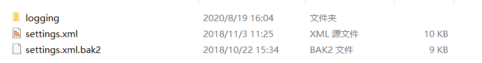
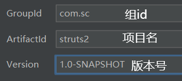

# Maven

## 1、什么是maven?

maven是基于项目对象模型，针对于项目的构建管理工具，用于管理整个项目生命周期。

## 2、使用maven

### 1、配置环境变量

添加两个环境变量


path中追加


验证配置成功：cmd下 mvn -version

### 2、配置maven

打开maven目录下的conf文件夹



注：settings.xml为当前使用的配置文件，bak2为私服，可以有多个

1. 配置本地仓库

   

2. 配置远程仓库

   

   默认是配置到国外的仓库（类似github），改到配置到阿里云的远程仓库：

```xml
<mirrors>
    <mirror>
        <id>alimaven</id>
        <name>aliyun maven</name>
        <url>http://maven.aliyun.com/nexus/content/groups/public/</url>
        <mirrorOf>central</mirrorOf>        
    </mirror>
</mirrors>
```

## 3、IDEA关联maven

在setting中配置maven


通过maven创建项目


选择好项目以后配置项目：



1. 组id：一般为公司域名倒序
2. 项目名：当前项目的名称
3. 版本号：代码的版本

## 4、maven项目的目录结构

默认只有main下的webapp

需要手动创建java resoutrces和test包下的对应文件


main->java：存放java代码目录

main->resources：存放java代码对应的配置文件目录

main->webapp: web资源


test->java：存放测试java代码目录

test->resoutces：存放测试代码的配置文件目录

**最重要文件:**

**pom.xml**

**注：创建完成后需要右键标记包含义**

标记为XX资源

Sources Root 源代码

Test Sources Root 测试源代码

Resoutrces Root 源代码配置文件

Test Resoutrces Root 测试源代码配置文件